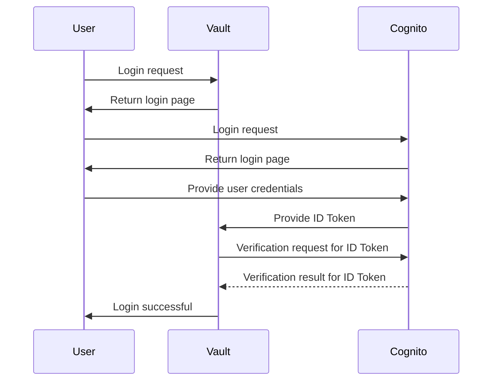

# Configuring Vault OIDC Authentication with AWS Cognito

## Introduction

This Terraform code guides you on configuring Vault's OIDC (Authentication Method) using AWS Cognito. It's aimed at individuals using AWS infrastructure and security services, with the goal of setting up robust authentication for Vault using AWS Cognito as the Identity Provider (IDP).

## AWS Cognito and Vault Configuration

The following Terraform code includes the necessary configurations for AWS Cognito and Vault. Before using the code, make sure to meet the requirements below.

### Requirements

- AWS account with appropriate access permissions
- AWS CLI and Terraform installed
- Vault server access and management permissions

### Setup Instructions

1. Create an 

   ```
   env.sh
   ```

    file to set the address, namespace, and token of your Vault server.

   - VAULT_ADDR
   - VAULT_NAMESPACE (for Enterprise/HCP)
   - VAULT_TOKEN

2. Use the Terraform code below to configure AWS Cognito and Vault.

3. Apply the code using Terraform to deploy the configuration.

### Code Description

- `aws_cognito_user_pool`: Creates an AWS Cognito user pool for Vault authentication.
- `aws_cognito_user_pool_client`: Generates a client for Vault and configures necessary OAuth flows, scopes, and callback URLs.
- `aws_cognito_user_pool_domain`: Creates a domain for the user pool.
- `aws_cognito_user`: Adds a user to AWS Cognito.
- `vault_jwt_auth_backend`: Configures Vault's OIDC backend to use AWS Cognito as the IDP.
- `vault_policy`: Sets up policies to be used in Vault.
- `vault_jwt_auth_backend_role`: Defines roles in Vault to manage authentication using AWS Cognito.

### Notes

- Before applying the code, initialize and plan with Terraform.
- Modify the `env.sh` file to set the address, namespace, and token of your Vault server before applying the code.
- Verify AWS Cognito user pool and client configurations before applying the code.
- After applying the code, verify and test the settings in Vault and AWS Cognito.

## Advantages of Using AWS Cognito

- **Unified Security**: Configuring robust authentication for Vault using AWS Cognito enhances security by integrating with AWS account user and group management systems.
- **Simplified User Management**: Leveraging AWS Cognito's user management and authentication system streamlines user administration and improves user experience.
- **Ease of Management**: Utilizing the hosted Cognito service from AWS simplifies management and operations while leveraging various security features offered by AWS.

## Vault Authentication Screenshots




- Type: OIDC
- Path: cognito


- Check the `sub` ID


- Vault entity alias ID mapped to OIDC sub ID